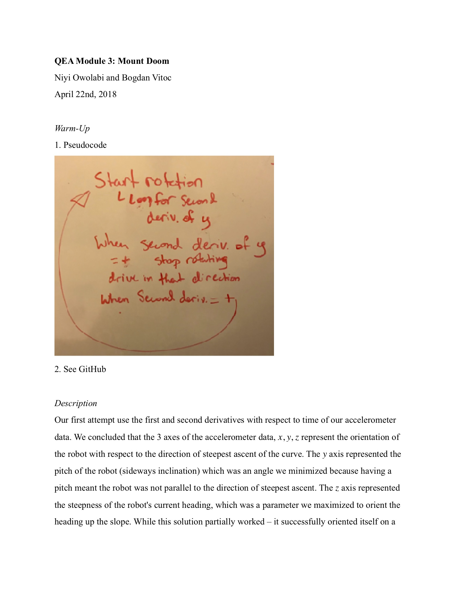

# QEA Robots Night 4 - Mount Doom
Niyi Owolabi and Bogdan Vitoc
April 22nd, 2018

MATLAB:
- First (failed) approach is in [`mountdoom.m`](mountdoom.m)
- Second (successfull) approach is in [`mountdoomgrad.m`](mountdoomgrad.m)

## Report

